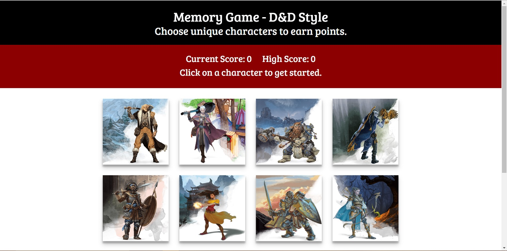
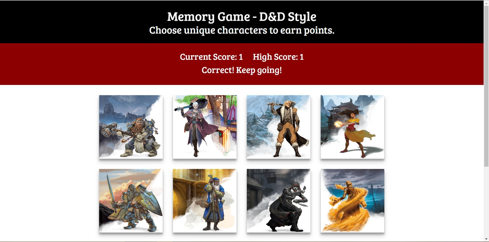
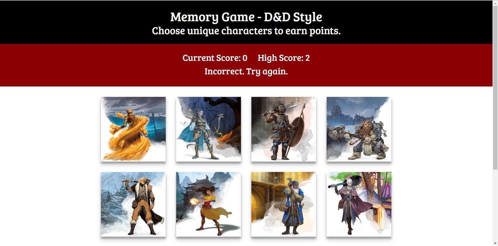

# memory-game

## Description

A simple memory game which challenges the player to select as many unique Dungeons & Dragons chatacters as they can without selecting the same character twice. It was developed to practice and demonstrate my skills with an emphasis on React, and hopefully provide a little fun, too!

## Walkthrough

To start the game, simply select any character image in the play area. Keep in mind that the images will be shuffled after every selection.

Continue selecting unqiue character images to score points and raise your high score.

Careful, selecting the same character twice will reset your current score!

## Contribution and Help

Morrowii is the sole person maintaining and contributing to this project.

If you need help with anything related to this project, drop me a line on GitHub.

## Live Demo

The deployed app can be viewed here: https://morrowii.github.io/memory-game/